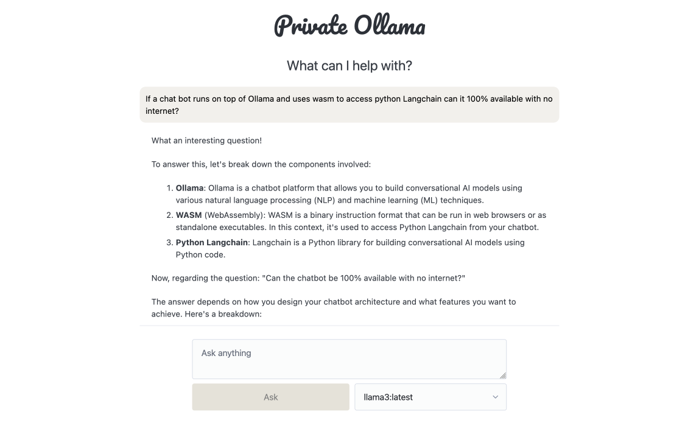

# 🛡️ Private Ollama: The 100% Private LLM Chatbot

A **fully offline**, secure, and open-source chatbot built with:

- 🔧 **Ollama** (local LLM engine)
- 🧱 **Lit** (web components for modern UI)
- 🧠 **Langchain + Pyodide** (LLM orchestration in WebAssembly)
\
\
👉 [🔗 Live Demo](https://freedomson.github.io/midinho/)


---
## 🚀 Project Overview

**Private Ollama** is a client-side chatbot application that leverages modern web and AI technology to provide:

- ✅ Full **local execution** of LLM inference  
- ✅ Zero data leakage – no internet access required post-load  
- ✅ Cross-platform browser support  
- ✅ Extendability with WebAssembly-based Python (Pyodide)

---
## 🧩 Tech Stack Breakdown

| Component      | Technology                                     | Role                                                   |
|----------------|------------------------------------------------|--------------------------------------------------------|
| 🧠 LLM Engine   | [Ollama](https://ollama.com)                  | Serves LLM models locally (e.g., Mistral, LLaMA, etc.) |
| ⚛️ Frontend UI  | [Lit](https://lit.dev)                        | Creates modern, reactive web components                |
| 🔗 LLM Pipeline | [Langchain](https://www.langchain.com) + [Pyodide](https://pyodide.org) | Enables Python-based logic and toolchains in-browser   |
| 🌐 Runtime      | Pyodide + WebAssembly                          | Runs Python Langchain in the browser, no server needed |

---

## 🔒 Privacy & Offline Capabilities

### 🔁 Works Fully Offline

- Once loaded in the browser, **no internet is required** to:
  - Run the chatbot  
  - Query the model  
  - Process prompts or tools  

### 🔐 100% Local Data Flow

- No telemetry, logging, or external API calls
- Everything runs:
  - In your browser (UI + logic)
  - On your machine (model served locally via Ollama)

### 🔋 Use Cases

- Secure research  
- Education in remote/offline environments  
- Local-only enterprise chatbots  
- LLM experimentation sandbox  

---

## 🖼️ App Architecture

```
+---------------------------+
|        Browser UI         |
| (Lit Web Components)      |
+------------+--------------+
             |
             v
+---------------------------+
|   Pyodide (Python WASM)   |
|  + Langchain Orchestration|
+------------+--------------+
             |
             v
+---------------------------+
|     Ollama Local Engine   |
|   (Runs on localhost:11434)|
+---------------------------+
```
---

## 📦 Run on the internet

1. **Start Ollama locally** on your machine \
    [Download and install Ollama locally](https://ollama.com/download)

   ```bash
      # Run llama3
      ollama run llama3
      # Test status
      curl http://localhost:11434
      Ollama is running%
2. **🧪 Open Live Example UI** \
👉 [https://freedomson.github.io/midinho/](https://freedomson.github.io/midinho/)

- No backend required
- Loads Pyodide + Langchain in-browser
- Connects to local Ollama for LLM completions


## 📦 Run on your computer

1. **Start Ollama Locally** on your machine \
    [Download and install Ollama locally](https://ollama.com/download)

   ```bash
      # Run llama3
      ollama run llama3
      # Test status
      curl http://localhost:11434
      Ollama is running%
2. **Serve Live LLM Chat Bot with Python**
   ```bash
      cd static
      python server.py
2. **🧪 Open Live Example UI** \
👉 [http://localhost:8000/](http://localhost:8000/)

##  📬 Feedback & Contributions

💬 Request features or report issues:\
👉 [GitHub Issues](https://github.com/freedomson/midinho/issues)


## 📄 License

Private Ollama is open source and respects your digital freedom.
Use it. Hack it. Share it.
